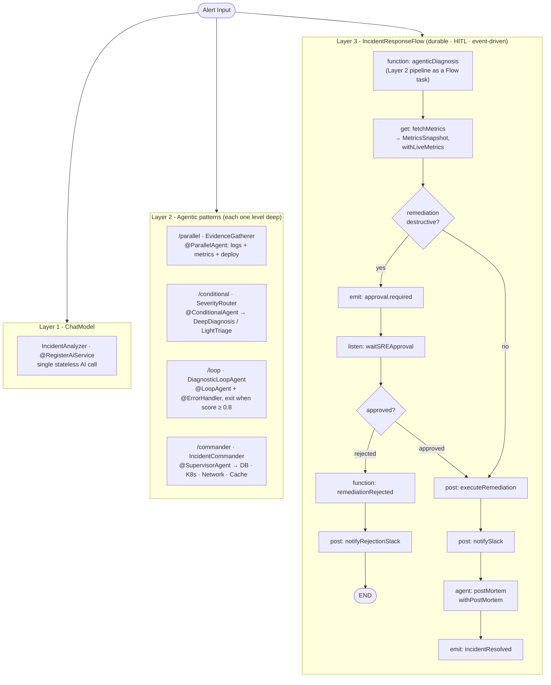

# Incident Response SRE

A demo of the 3-layer evolution of AI-powered incident response, built with **Quarkus**, **Quarkus LangChain4j (Agentic)**, and **Quarkus Flow** - from a single stateless AI call, to a toolbox of agentic patterns, to a durable, human-gated, event-driven workflow.

The point of the demo is the **combination**: LangChain4j gives you the agents, Flow gives those agents durability, human-in-the-loop, eventing, and crash recovery.

## Quick start

```bash
# Default provider is NVIDIA NIM (OpenAI-compatible). Export your key:
export NVIDIA_AI_API_KEY=nvapi-...
./mvnw quarkus:dev
```

No NVIDIA key? Run fully local on Ollama (Dev Services starts it and pulls the models):

```bash
./mvnw quarkus:dev -Dquarkus.profile=ollama,dev
```

Then open the **live console at http://localhost:8080/** and trigger an incident to watch it run → pause for approval → resolve. Dev Services starts PostgreSQL, Kafka (Redpanda), and WireMock automatically (plus Ollama on the `ollama` profile).

> Flow `0.10.0` and Quarkus LangChain4j `1.11.0.CR1` both resolve from public repositories - no local build step required.

## The 3-Layer Evolution

### Layer 1: ChatModel (a single AI Service)

A single `@RegisterAiService` that turns alert text into structured analysis. Stateless: no memory, no iteration, no durability.

**Endpoint:** `POST /incidents/alert`

```bash
curl -X POST http://localhost:8080/incidents/alert \
  -H "Content-Type: application/json" \
  -d '{"source":"prometheus","service":"api-gateway","metric":"error_rate",
       "value":15.5,"threshold":5.0,"message":"Error rate 15.5% > 5.0%"}'
```

### Layer 2: Agentic patterns (LangChain4j Agentic)

Each agentic pattern is exposed on its own endpoint so you can see them in isolation. Every agentic graph is kept **one level deep** - the higher-level orchestration is done in plain Java/Flow. (A graph that nests a `@ParallelAgent` and a `@ConditionalAgent` as siblings in the same Flow-compiled topology deadlocks; keeping each graph shallow and threading the shared evidence through one `evidenceText` value avoids it.)

| Pattern | Endpoint | What it shows |
|---------|----------|---------------|
| `@ParallelAgent` | `POST /incidents/parallel` | Fan-out: logs + metrics + deploy-history evidence agents run concurrently (on a small/fast model). |
| `@ConditionalAgent` | `POST /incidents/conditional` | Severity router: P1/P2 take a deep evidence-driven diagnosis, P3/P4 a light triage (`@ActivationCondition`). |
| `@LoopAgent` | `POST /incidents/loop` | Diagnose → remediate → score, refined until `@ExitCondition` confidence ≥ 0.8. Carries an `@ErrorHandler` for resilience (see below). |
| `@SupervisorAgent` | `POST /incidents/commander` | An LLM "incident commander" autonomously decides which domain specialists (database, kubernetes, network, cache) to consult, then synthesizes their findings (`responseStrategy = SUMMARY`). |

```bash
# @SupervisorAgent: the commander routes to the relevant specialists on its own
curl -X POST http://localhost:8080/incidents/commander \
  -H "Content-Type: application/json" \
  -d '{"source":"prometheus","service":"checkout-api","metric":"db_pool_active",
       "value":100,"threshold":80,
       "message":"p99 8s, HikariCP pool exhausted, threads blocked on connections"}'
```

All four bodies use the same `AlertInput` shape as Layer 1.

**Big + small model split.** The default provider (NVIDIA NIM) uses `meta/llama-3.3-70b-instruct` for reasoning and the smaller `meta/llama-3.1-8b-instruct` (`@ModelName("evidence")`) for the parallel evidence agents and the supervisor specialists, keeping the concurrent fan-out cheap against the rate limit.

#### Agentic resilience: `@ErrorHandler`

`DiagnosticLoopAgent` carries a static `@ErrorHandler` that turns three classes of agentic failure into graceful behaviour instead of a crash:

- **Missing scope argument** (`MissingArgumentException`) → seed a sensible default into the `AgenticScope` and `retry()`.
- **Transient LLM error** (timeout / 429 / rate limit) → bounded single `retry()` (on top of the client's own `max-retries`).
- **Anything else** (e.g. invalid JSON from the model) → write a fallback score and `result(...)` a best-effort partial answer so the loop completes.

### Layer 3: Flow (durable workflow with HITL)

The `IncidentResponseFlow` orchestrates the agentic work and adds what agents alone cannot:

- **Agentic subflow**: the diagnosis stage is an agentic pipeline wired in as a Flow `function(...)` task (`IncidentDiagnosisService` → classify → gather evidence → severity-routed diagnosis), its result exported as task output.
- **Durability**: MVStore-backed persistence (a file at `~/incident-response-sre-flow.mv.db`). Workflow state survives a full JVM restart.
- **Human-in-the-Loop**: destructive remediations (`RESTART_POD`, `SCALE_DOWN`) require SRE approval. The workflow emits an approval-request CloudEvent, pauses at `listen`, and resumes when the approval/rejection event arrives.
- **External integrations**: HTTP tasks fetch Prometheus metrics, execute remediation via a deployment API, and notify Slack (all stubbed by WireMock in dev/test).
- **End-to-end type safety**: every Flow transform is fully typed - no `Object.class`. The Prometheus response deserializes into a `MetricsSnapshot` record that is folded into `IncidentResult` (`withLiveMetrics`) and re-exported to the workflow context, so the live telemetry survives downstream restores and feeds the post-mortem prompt. HTTP request/response bodies (`SlackMessage`/`SlackAck`, `RemediationCommand`) and the rejection branch (`RemediationRejection`) are records, not maps.
- **Agentic post-mortem**: after remediation, a post-mortem agent (`WorkflowPostMortemAgent`) summarizes the incident (using the diagnosis, remediation and live metrics) as its own Flow `agent(...)` task; the generated summary is captured back into `IncidentResult` (`withPostMortem`) and projected onto the `Incident` record.
- **Event-driven both ways**: consumes alerts/approvals from `flow-in`; publishes domain events (`flow-out`) and per-task lifecycle (`flow-lifecycle-out`) as CloudEvents over Kafka.
- **Read-model projection**: `IncidentEventBridge` consumes the workflow's own `flow-out` events and projects them back onto the `Incident` JPA record (`PENDING_APPROVAL` when it pauses for HITL, `RESOLVED` when it completes), so `GET /incidents/{id}` stays consistent with the live dashboard.

**Endpoints:**

| Method | Path | Purpose |
|--------|------|---------|
| `POST` | `/incidents/workflow` | Start the durable workflow for an alert. |
| `PUT` | `/incidents/{incidentId}/approve` \| `/reject` | Approve/reject via the incident record. |
| `PUT` | `/incidents/workflow/{workflowInstanceId}/approve` \| `/reject` | Approve/reject by **workflow instance id** - decoupled from the `Incident` entity, so HITL still works after a restart even if the entity DB was reset. |
| `GET` | `/incidents/{incidentId}` | The persisted incident record. |

Whether the workflow takes the HITL path depends on triage classifying the remediation as `destructive`. The alert below describes an unrecoverable, hung service, reliably triaged as a destructive restart:

```bash
# 1) Start the workflow and capture the incident id
INCID=$(curl -s -X POST http://localhost:8080/incidents/workflow \
  -H "Content-Type: application/json" \
  -d '{"source":"prometheus","service":"payment-service","metric":"thread_deadlock",
       "value":100,"threshold":1,
       "message":"payment-service fully deadlocked: all worker threads BLOCKED, 100% of requests failing, liveness probe failing. Process is hung and unrecoverable; standard remediation is an immediate pod restart."}' \
  | jq -r .incidentId)
echo "incident: $INCID"

# 2) Triage runs, then the workflow PAUSES at the approval gate (watch the app log / live console).

# 3a) Approve -> resumes -> executeRemediation -> notifySlack -> postMortem -> resolved
curl -X PUT "http://localhost:8080/incidents/$INCID/approve" \
  -H "Content-Type: application/json" \
  -d '{"reviewer":"sre-oncall","reason":"Confirmed deadlock; restart approved"}'

# 3b) ...or Reject -> rejection notice -> END (no remediation executed)
# curl -X PUT "http://localhost:8080/incidents/$INCID/reject" ...

# 4) Inspect the persisted incident
curl -s "http://localhost:8080/incidents/$INCID" | jq
```

A non-destructive alert skips the approval gate and runs straight through `executeRemediation → notifySlack → postMortem → resolved`.

## Persistence: why MVStore (and the JPA caveat)

Flow persistence is **MVStore** (`quarkus-flow-mvstore`), a file-based store that survives restarts. `quarkus-flow-jpa` is **not** used here: its `JpaPersistenceExecutor.execute(...)` is `@Transactional`, so the JTA transaction starts on the calling thread. When a workflow task completes on a Vert.x event-loop thread (the Kafka `emitJson` approval-request), the persistence checkpoint runs there too and fails with *"@Transactional cannot start a JTA transaction within a reactive pipeline."* MVStore uses the default non-transactional `AsyncPersistenceExecutor`, which persists off the event loop.

The Layer 2 agentic graphs are AOT-compiled into Flow workflows but have no marshaller for their `AgenticScope`-backed state, so they run **in-memory** (`quarkus.flow.persistence.exclude-workflows`). Only the Layer 3 `incident-response` workflow is persisted - it is the one that needs to survive an HITL pause. PostgreSQL still backs the `Incident`/`Alert` JPA entities; it is unrelated to Flow persistence.

### Registered workflows (Flow Dev UI)

Six `WorkflowDefinition` beans are registered - five AOT-compiled agentic graphs (run in-memory) plus the durable Layer 3 flow. Every one is reachable; there are no orphans. The `@SupervisorAgent` commander is **not** compiled into a Flow workflow (pure LLM orchestration), so it does not appear here.

| Workflow | Pattern | Reached by |
|----------|---------|-----------|
| `evidence-gatherer` | @ParallelAgent | `/incidents/parallel` (also reused by conditional & loop) |
| `severity-router` | @ConditionalAgent | `/incidents/conditional` |
| `deep-diagnosis-agent` | @SequenceAgent | P1/P2 branch of `severity-router` |
| `light-triage-agent` | @SequenceAgent | P3/P4 branch of `severity-router` |
| `diagnostic-loop-agent` | @LoopAgent | `/incidents/loop` |
| `incident-response` | Flow (durable) | `/incidents/workflow` |

> Trade-off: the MVStore file lock is exclusive and not released on hot reload, so iterate with a full stop/start rather than relying on live reload.

## Eventing (CloudEvents over Kafka)

The app both **consumes from** and **publishes to** Kafka topics (Redpanda via Dev Services). Everything is CloudEvents:

| Topic | App direction | By | Carries |
|-------|---------------|----|---------|
| `flow-in` | **consume** | Flow engine | alerts and approval/rejection replies that start or resume workflows |
| `flow-in` | **publish** | `IncidentResource` (`flow-in-outgoing`) | the approval/rejection CloudEvent sent when an SRE clicks approve/reject |
| `flow-out` | **publish** | Flow domain publisher | workflow `emit`s (`incident.approval.required`, `incident.resolved`) |
| `flow-out` | **consume** | `IncidentEventBridge` | forwarded to the dashboard WebSocket |
| `flow-lifecycle-out` | **publish** | Flow lifecycle publisher | per-task lifecycle (`task.started/completed`, `workflow.started/completed`) |
| `flow-lifecycle-out` | **consume** | `IncidentEventBridge` | drives live per-step progress on each card |

Publishing is enabled by `quarkus.flow.messaging.defaults-enabled=true` (domain) and `quarkus.flow.messaging.lifecycle-enabled=true` (lifecycle). Flow's domain publisher binds only to a channel named exactly **`flow-out`**.

## Observing the demo

### Live console (recommended) - `http://localhost:8080/`

A lightweight dashboard (static HTML + a `@ServerEndpoint` WebSocket fed by the Flow `flow-out` topic, no Quinoa/npm) at `/console.html`. It drives **all three layers** from one screen: run the L1 ChatModel and the four L2 patterns (synchronous result cards), and trigger the L3 durable workflow - watching incidents update live (`TRIAGING → ⏸ AWAITING APPROVAL → RESOLVED`) and approving/rejecting a destructive remediation right from the card.

Implementation: `com.acme.sre.messaging.IncidentEventBridge` (consumes `flow-out`/`flow-lifecycle-out`) + `IncidentDashboardSocket` (`/ws/incidents`) + `META-INF/resources/{index,console}.html` (landing + console).

### Other surfaces

- **App log** - every task is traced; the HITL pause shows `Task 'waitSREApproval' started` (paused), then resumes after approve.
- **Swagger UI**: <http://localhost:8080/q/swagger-ui>
- **Flow Dev UI**: <http://localhost:8080/q/dev-ui/quarkus-flow/workflows> - registered workflow definitions; the agentic **Topology** page visualizes each agent graph.
- **WireMock Dev UI** - inspect the stub mappings for the external integrations.

## Architecture

The same alert can be handled by any of the three layers; Layer 3 reuses the Layer 2 agentic pipeline as a Flow task and wraps it with durability, HITL and eventing.



The terminal/HITL state of the Layer 3 workflow is projected back onto the `Incident` JPA record (via `flow-out` CloudEvents) so `GET /incidents/{id}` stays consistent with the live console.

## Project structure

```
src/main/java/com/acme/sre/
├── ai/
│   ├── triage/IncidentAnalyzer            Layer 1 - single @RegisterAiService
│   ├── diagnostics/                       Layer 2 - agentic patterns + leaf agents
│   │   ├── EvidenceGatherer (@ParallelAgent), LogsAnalysisAgent, MetricsAnalysisAgent, DeployHistoryAgent
│   │   ├── SeverityRouter (@ConditionalAgent), DeepDiagnosisAgent, LightTriageAgent, …
│   │   ├── DiagnosticLoopAgent (@LoopAgent + @ErrorHandler), DiagnosticAgent, RemediationAgent, ConfidenceScorer
│   │   ├── SeverityClassifier
│   │   └── IncidentDiagnosisService        plain CDI orchestration used by the Flow task
│   ├── commander/                         Layer 2 - @SupervisorAgent + 4 domain specialists
│   ├── response/WorkflowPostMortemAgent   Layer 3 - post-mortem agent (a Flow task)
│   └── support/                           lenient JSON hardening (ConfidenceScore deser) for agentic/Flow paths
├── flow/IncidentResponseFlow              Layer 3 - the durable Workflow descriptor
├── api/                                   REST boundary
│   ├── IncidentResource                   endpoints (alert / parallel / conditional / loop / commander / workflow / approve / reject / get), returns typed DTOs
│   ├── dto/                               response DTOs + IncidentView (entity never exposed) + ApiError
│   └── ApiException · IncidentNotFoundException · WorkflowNotActiveException · ApiExceptionMapper
├── messaging/                             IncidentEventBridge + IncidentDashboardSocket (live console) + IncidentProjectionUpdater + ApprovalEventPublisher (HITL CloudEvent)
└── domain/                                domain types, split by role
    ├── model/                             JPA entities + enums (Alert, Incident, Severity, ActionType, IncidentStatus)
    ├── diagnosis/                         agentic value objects (Diagnosis, Evidence, RemediationAction, ConfidenceScore, IncidentResult, MetricsSnapshot, …)
    └── contract/                          boundary payloads (AlertInput, TriagePrompt, ApprovalResponse, SlackMessage/SlackAck, RemediationCommand/Rejection)
src/main/resources/
├── application.properties                 LLM, datasource, Flow persistence + exclude-workflows, Kafka channels
└── META-INF/resources/{index,console}.html  landing page + the all-layers live console
src/test/resources/mappings/              WireMock stubs (Prometheus / deployment / Slack)
docker-compose.yml                         optional persistent Postgres
```

## Tech stack

- **Quarkus** 3.36.0 (Java 25)
- **Quarkus LangChain4j** 1.11.0.CR1 (Agentic; OpenAI/NVIDIA + Ollama providers)
- **Quarkus Flow** 0.10.0 (`mvstore` persistence, `messaging`, `langchain4j`)
- **Quarkus REST** (`rest-jackson`, the reactive stack) - typed DTO endpoints + exception mapper
- **Hibernate ORM with Panache** on **PostgreSQL** - the `Incident`/`Alert` read model
- **SmallRye Reactive Messaging (Kafka)** + **CloudEvents** - the event bus (`flow-in` / `flow-out` / `flow-lifecycle-out`)
- **WebSockets** - the live console feed
- **PostgreSQL**, **Kafka/Redpanda**, **WireMock** - all via Dev Services
- **Ollama** (optional, `ollama` profile) for fully-local runs

## Testing

```bash
# Default suite: deterministic, no real LLM (agentic beans / ChatModel / Flow are mocked)
./mvnw test

# End-to-end against a real LLM (slow; excluded by the `real-llm` JUnit tag)
./mvnw test -Preal-llm
```

The default suite (26 tests) covers: lenient confidence parsing, the `@LoopAgent` exit condition and `@ErrorHandler` recovery logic (pure unit tests), the per-pattern Layer 2 endpoints (parallel / conditional / loop / commander) with mocked agentic beans, the Layer 3 workflow start + HITL endpoints, the workflow→`Incident` read-model projection, and the WireMock-stubbed integrations. Tests run on the `test` profile (pinned to Ollama; no NVIDIA key needed).

## Crash recovery

A workflow paused at HITL is persisted to the MVStore file and survives a hard `kill -9` of the JVM. After restart, Flow rehydrates the suspended instance when its correlated `flow-in` approval event arrives (resume is event-driven, not eager-on-boot). Use the `/incidents/workflow/{workflowInstanceId}/approve` endpoint to approve by instance id after a restart. `docker-compose.yml` provides an optional persistent Postgres if you also want the `Incident` entities to outlive the JVM.

## Related guides

- Quarkus LangChain4j: <https://docs.quarkiverse.io/quarkus-langchain4j/dev/>
- LangChain4j Agentic: <https://docs.langchain4j.dev/tutorials/agents/>
- Quarkus Flow: <https://docs.quarkiverse.io/quarkus-flow/dev/>
- SmallRye Kafka: <https://quarkus.io/guides/kafka>
